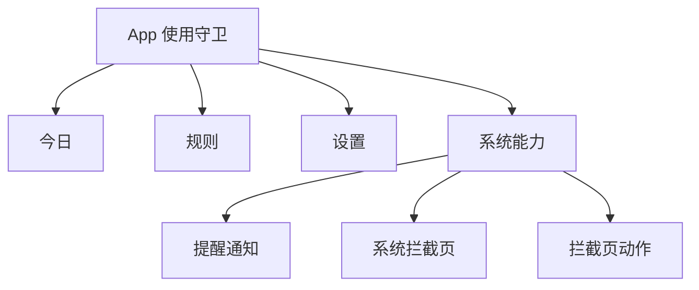
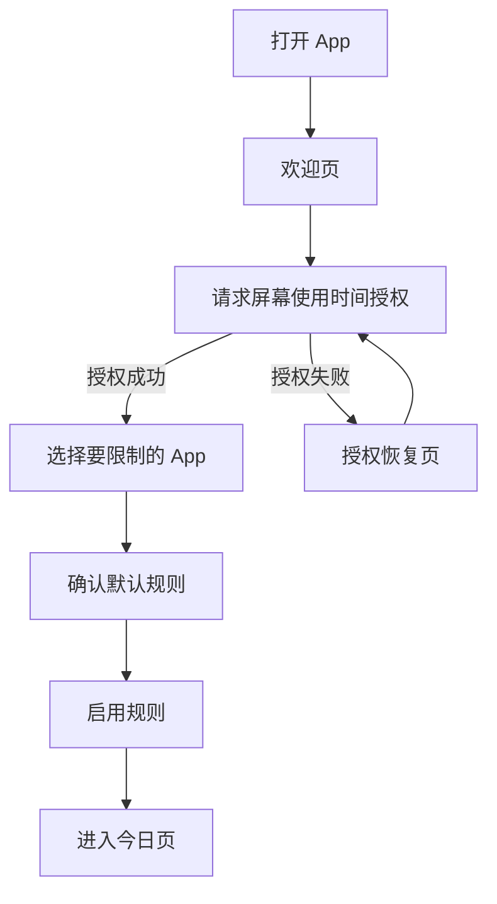
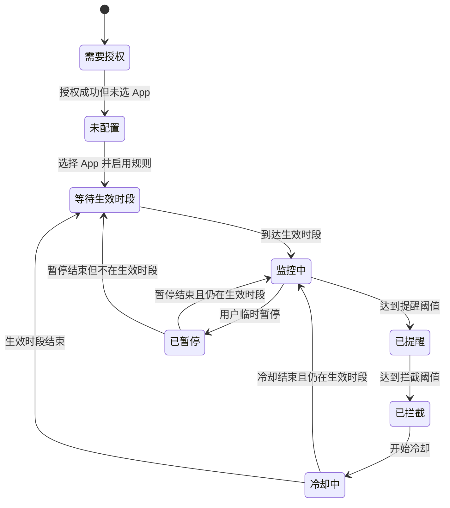

# MVP 交互原型文档：App 使用守卫

## 1. 产品定位

这是一款本地使用的 iPhone 自控工具。它不试图判断你在微信里具体看的是聊天、朋友圈还是视频号，而是先用 iOS 官方的屏幕使用时间能力，限制你选中的 App。

第一版重点解决这个场景：

- 下班后容易无意识打开微信。
- 打开后容易进入视频号并连续刷。
- 到 10 分钟时提醒你停一下。
- 到 12 分钟时系统级拦截微信。
- 被限制的 App、提醒时间、拦截时间、冷却时间、启用时段、提醒文案、拦截文案都可以配置。
- 第一版就支持“禁止延迟”的硬核模式，避免临时起意时轻易放行。
- 拦截后引导用户去微信读书，把“刷视频”的动作替换成“阅读”。

MVP 的原则是：先做一个能真实拦住自己的版本，再考虑更细的页面级识别。

## 2. MVP 目标

- 用户可以授权屏幕使用时间权限。
- 用户可以选择一个或多个需要限制的 App，比如微信。
- 用户可以配置提醒阈值、拦截阈值、冷却时间和启用时段。
- 用户可以自定义提醒通知文案。
- 用户可以自定义拦截页标题、说明和按钮文案。
- 用户可以开启硬核模式：禁止延迟、限制临时暂停、限制即时修改规则。
- 用户可以配置拦截后的替代动作，比如引导打开微信读书。
- 到达提醒时间后，App 发出通知。
- 到达拦截时间后，iOS 展示系统级拦截页。
- 用户可以在 App 内看到当前规则是否正在生效。

## 3. MVP 暂不做

- 不识别微信视频号页面。
- 不读取微信内部页面内容。
- 不使用 VPN、MDM、私有 API 或越狱能力。
- 不做账号系统。
- 不做云同步。
- 不做社交监督。
- 不做复杂数据分析。
- 不做多条规则冲突处理。
- 不保证一定能从系统拦截页直接打开微信读书。第一版会做稳定引导，并把直接跳转作为真机实验能力验证。

## 4. 产品结构

MVP 主 App 使用 3 个底部 Tab：

1. 今日
2. 规则
3. 设置

系统扩展页面：

1. 提醒通知
2. 拦截页
3. 拦截页按钮动作



## 5. 首次使用流程

首次使用要尽量短。用户只需要完成 3 件事：授权、选择 App、启用默认规则。



### 5.1 欢迎页

目的：用一句话说明 App 的用途，让用户进入设置。

文案：

- 标题：停一下
- 副标题：到了你设定的时间，就帮你把正在刷的 App 拦住。
- 主按钮：开始设置
- 辅助说明：所有规则只在本机运行。

线框图：

```text
┌─────────────────────────┐
│                         │
│          停一下          │
│                         │
│ 到了你设定的时间，       │
│ 就帮你把正在刷的 App     │
│ 拦住。                  │
│                         │
│ [ 开始设置 ]             │
│                         │
│ 所有规则只在本机运行。   │
└─────────────────────────┘
```

点击“开始设置”后，请求 `FamilyControls` 授权。

### 5.2 授权页 / 授权恢复页

目的：获得 iOS 屏幕使用时间权限。

系统动作：

- 调用 `AuthorizationCenter.shared.requestAuthorization(for: .individual)`。

授权状态：

- 授权成功：进入 App 选择页。
- 用户拒绝：展示授权恢复页。
- 系统不可用：展示原因说明。

授权失败文案：

- 标题：需要屏幕使用时间权限
- 说明：没有这个权限，App 无法统计使用时长或拦截选中的 App。
- 主按钮：重新授权
- 次按钮：稍后再说

线框图：

```text
┌─────────────────────────┐
│ 需要屏幕使用时间权限     │
│                         │
│ 没有这个权限，App 无法   │
│ 统计使用时长或拦截选中   │
│ 的 App。                │
│                         │
│ [ 重新授权 ]             │
│   稍后再说               │
└─────────────────────────┘
```

### 5.3 选择限制 App

目的：让用户选择需要限制的 App。第一版建议先选择微信，但设计上支持多个 App。

界面元素：

- 标题：选择要限制的 App
- 当前选择预览
- 按钮：选择 App
- 主按钮：下一步

系统组件：

- `FamilyActivityPicker`

校验规则：

- 至少选择一个 App 才能进入下一步。
- 未选择时，“下一步”置灰，并提示“至少选择一个 App。”

线框图：

```text
┌─────────────────────────┐
│ 选择要限制的 App         │
│                         │
│ 已选择                  │
│ ┌─────────────────────┐ │
│ │ 微信                │ │
│ └─────────────────────┘ │
│                         │
│ [ 选择 App ]             │
│                         │
│ [ 下一步 ]               │
└─────────────────────────┘
```

### 5.4 默认规则确认

目的：给用户一个能直接使用的默认配置，降低首次设置成本。

默认规则：

- 规则名称：晚上别刷太久
- 限制 App：用户刚才选择的 App
- 启用日期：周一到周日
- 启用时段：19:00-24:00
- 提醒时间：10 分钟
- 拦截时间：12 分钟
- 冷却时间：20 分钟
- 硬核模式：开启
- 是否允许延迟：关闭
- 是否允许临时暂停：关闭
- 是否允许立即修改规则：关闭
- 规则修改等待时间：明天生效
- 替代动作：引导打开微信读书

线框图：

```text
┌─────────────────────────┐
│ 确认规则                 │
│                         │
│ 晚上别刷太久             │
│                         │
│ 限制 App：微信           │
│ 生效时间：每天 19:00-24:00│
│ 10 分钟提醒              │
│ 12 分钟拦截              │
│ 冷却 20 分钟             │
│ 硬核模式：开启           │
│ 拦截后：去微信读书       │
│                         │
│ [ 启用规则 ]             │
└─────────────────────────┘
```

点击“启用规则”后进入“今日”Tab。

## 6. 今日 Tab

目的：告诉用户现在规则是否生效，以及接下来会发生什么。

### 6.1 页面结构

```text
┌─────────────────────────┐
│ 今日                     │
│                         │
│ ┌─────────────────────┐ │
│ │ 保护中              │ │
│ │ 晚上别刷太久        │ │
│ │ 微信使用 10 分钟提醒 │ │
│ │ 12 分钟后拦截        │ │
│ │ 当前时段 19:00-24:00 │ │
│ └─────────────────────┘ │
│                         │
│ [ 编辑规则 ]             │
│ [ 临时暂停 ]             │
│                         │
│ 底部 Tab：今日｜规则｜设置│
└─────────────────────────┘
```

### 6.2 状态展示

未授权：

- 状态：未授权
- 说明：授权后才能启用规则。
- 操作：去授权

未配置：

- 状态：未配置
- 说明：选择一个或多个 App 后开始保护。
- 操作：选择 App

未到时段：

- 状态：未到时段
- 说明：今天 19:00 开始保护。
- 操作：编辑规则

保护中：

- 状态：保护中
- 说明：微信使用 10 分钟提醒，12 分钟拦截。
- 操作：编辑规则、临时暂停

已暂停：

- 状态：已暂停
- 说明：规则暂停到 HH:mm。
- 操作：立即恢复

已拦截：

- 状态：已拦截
- 说明：冷却结束前无法继续使用选中的 App。
- 操作：查看规则

## 7. 规则 Tab

目的：配置要拦什么、什么时候拦、怎么提醒、拦截多久。

MVP 只支持一条规则，但界面结构预留以后支持多条规则。

### 7.1 页面结构

```text
┌─────────────────────────┐
│ 规则                     │
│                         │
│ 规则名称                 │
│ [ 晚上别刷太久          ] │
│                         │
│ 启用规则        [ 开关 ] │
│                         │
│ 限制 App                 │
│ 微信                     │
│ [ 重新选择 App ]         │
│                         │
│ 生效时间                 │
│ 每天 19:00-24:00         │
│                         │
│ 10 分钟提醒              │
│ 12 分钟拦截              │
│ 冷却 20 分钟             │
│ 硬核模式已开启           │
│                         │
│ [ 申请修改 ] [ 测试提醒 ]│
└─────────────────────────┘
```

### 7.2 规则名称

控件：

- 单行输入框

默认值：

- 晚上别刷太久

校验：

- 必填。
- 最多 20 个中文字符或 40 个英文字符。

### 7.3 限制 App

控件：

- “选择 App”按钮
- 已选 App 预览

行为：

- 点击后打开 `FamilyActivityPicker`。
- 保存用户选择的 `ApplicationToken`。

校验：

- 启用规则前必须至少选择一个 App。

### 7.4 生效时段

控件：

- 星期选择：周一到周日
- 开始时间选择器
- 结束时间选择器

默认值：

- 每天
- 19:00-24:00

跨天规则：

- 如果结束时间早于开始时间，视为跨天。
- 例如 22:00-01:00 表示今天 22:00 到明天 01:00。

MVP 简化：

- 每天只支持一个生效时间段。

### 7.5 时间阈值

控件：

- 提醒时间：步进器或选择器
- 拦截时间：步进器或选择器

默认值：

- 10 分钟提醒
- 12 分钟拦截

校验：

- 提醒时间至少 1 分钟。
- 拦截时间必须大于提醒时间。
- 两者最小间隔 1 分钟。
- 最大值 8 小时。

展示文案：

- 使用 10 分钟时提醒
- 使用 12 分钟后拦截

### 7.6 冷却时间

含义：触发拦截后，多久以后自动解除拦截。

控件：

- 选择器

默认值：

- 20 分钟

选项：

- 5 分钟
- 10 分钟
- 20 分钟
- 30 分钟
- 60 分钟
- 直到明天

行为：

- 到达拦截阈值后，系统遮罩选中的 App。
- 遮罩持续到冷却结束，或当前生效时段结束，取较早者。

### 7.7 硬核模式

含义：规则一旦启用，不让当下冲动的自己轻易关掉、延迟或修改。

控件：

- 开关：硬核模式
- 开关：禁止延迟
- 开关：禁止临时暂停
- 规则修改等待时间选择器
- 紧急解锁说明输入框，可选

默认值：

- 开启
- 禁止延迟：开启
- 禁止临时暂停：开启
- 修改等待时间：明天生效

硬核模式下的行为：

- 拦截页不展示“延迟 3 分钟”。
- 今日页不展示“临时暂停”，或展示但不可用。
- 当前生效时段内修改规则，不立即生效。
- 修改后的规则进入“待生效”状态，默认从第二天 00:00 或下一个自然日生效。
- 关闭硬核模式也需要等待同样的生效时间。

非硬核模式保留的备用能力：

- 允许延迟一次。
- 延迟时长默认 3 分钟。
- 每天默认 1 次。

说明：

- 第一版默认使用硬核模式。
- 这比“能随时改规则”的自控软件更难绕开。
- 仍然保留“紧急解锁”的产品入口，但第一版默认不启用，避免它变成新的绕过按钮。

线框图：

```text
┌─────────────────────────┐
│ 硬核模式                 │
│                         │
│ 硬核模式        [ 开 ]   │
│ 禁止延迟        [ 开 ]   │
│ 禁止临时暂停    [ 开 ]   │
│                         │
│ 规则修改                 │
│ [ 明天生效       v ]     │
│                         │
│ 当前时段内不能立即关闭   │
│ 或降低限制。             │
└─────────────────────────┘
```

### 7.8 替代动作：去微信读书

含义：拦截不是只让你“不能刷”，而是给一个更好的替代动作。

第一版目标：

- 拦截页展示“去微信读书”按钮或提示。
- 点击后尽量关闭当前被拦截 App。
- 如果系统允许，通过 URL Scheme 或快捷指令尝试打开微信读书。
- 如果无法直接打开，则展示明确引导：“现在打开微信读书，读 10 分钟。”

配置项：

- 开关：拦截后引导阅读
- 替代 App 名称：微信读书
- 跳转方式：
  - 自动检测，默认
  - URL Scheme
  - 快捷指令
  - 仅文案引导
- 阅读目标时长：10 分钟
- 引导文案

默认值：

- 开启。
- 替代 App：微信读书。
- 阅读目标：10 分钟。
- 引导文案：现在去微信读书，读 10 分钟再回来。

技术边界：

- `ShieldActionExtension` 官方响应主要是 `close`、`defer`、`none`，不能保证直接拉起另一个 App。
- 稳定方案：按钮返回 `close`，关闭当前被拦截 App，并在拦截页文案中引导用户打开微信读书。
- 实验方案 A：主 App 中配置并测试微信读书 URL Scheme，真机验证后再启用。
- 实验方案 B：让用户创建一个“打开微信读书”的快捷指令，App 尝试打开该快捷指令。

线框图：

```text
┌─────────────────────────┐
│ 替代动作                 │
│                         │
│ 拦截后引导阅读  [ 开 ]   │
│ 替代 App                 │
│ [ 微信读书             ] │
│ 阅读目标                 │
│ [ 10 分钟              ] │
│ 跳转方式                 │
│ [ 自动检测             ] │
│                         │
│ [ 测试打开微信读书 ]     │
└─────────────────────────┘
```

### 7.9 提醒文案

控件：

- 通知标题输入框
- 通知正文多行输入框
- 通知预览

默认值：

- 标题：先停一下
- 正文：你已经刷了 10 分钟。先停一下，问问自己还要不要继续。

支持变量：

- `{app}`：选中的 App 名称，能取到时显示。
- `{minutes}`：提醒时间。

预览：

```text
┌─────────────────────────┐
│ 先停一下                 │
│ 你已经刷了 10 分钟。     │
│ 先停一下，问问自己还要   │
│ 不要继续。               │
└─────────────────────────┘
```

### 7.10 拦截页文案

控件：

- 拦截页标题
- 拦截页说明
- 主按钮文案
- 次按钮文案，硬核模式下用于替代动作
- 拦截页预览

默认值：

- 标题：先停一下
- 说明：你已经超过设定时间了。现在离开微信，去微信读书读 10 分钟。
- 主按钮：好的
- 次按钮：去微信读书

预览：

```text
┌─────────────────────────┐
│                         │
│        先停一下          │
│                         │
│ 你已经超过设定时间了。   │
│ 现在离开微信，去微信读书 │
│ 读 10 分钟。             │
│                         │
│ [ 好的 ]                 │
│ [ 去微信读书 ]           │
└─────────────────────────┘
```

说明：

- 真实拦截页由 iOS 系统展示。
- App 内预览只用于帮助用户理解最终效果，和系统页面不一定完全一致。

## 8. 设置 Tab

目的：放全局设置、授权状态和重置入口。

页面结构：

```text
┌─────────────────────────┐
│ 设置                     │
│                         │
│ 权限                     │
│ 屏幕使用时间：已授权     │
│ [ 重新授权 ]             │
│                         │
│ 通知                     │
│ 使用通知提醒    [ 开关 ] │
│ [ 测试通知 ]             │
│                         │
│ 数据                     │
│ [ 重置所有规则 ]         │
│                         │
│ 关于                     │
│ 版本 0.1                 │
│ 本 App 使用 iOS 屏幕     │
│ 使用时间能力在本机运行。 │
└─────────────────────────┘
```

## 9. 提醒通知

触发条件：

- 当前处于规则生效时段。
- 选中的 App 使用时长达到提醒阈值。

默认通知：

- 标题：先停一下
- 正文：你已经刷了 10 分钟。再过 2 分钟会拦截。

点击通知：

- 打开 App 并进入“今日”Tab。

如果用户关闭通知：

- 仍然在拦截阈值触发拦截。
- 今日页提示“通知未开启，提醒可能不会出现。”

## 10. 系统拦截页

触发条件：

- 当前处于规则生效时段。
- 选中的 App 使用时长达到拦截阈值。

系统行为：

- iOS 对选中的 App 展示遮罩页。
- App 通过 `ShieldConfigurationExtension` 自定义标题、说明和按钮。
- App 通过 `ShieldActionExtension` 处理按钮动作。
- 硬核模式下不提供延迟按钮。

默认文案：

- 标题：先停一下
- 说明：你已经超过设定时间了。现在离开微信，去微信读书读 10 分钟。
- 主按钮：好的
- 次按钮：去微信读书

按钮行为：

- “好的”：保持拦截。
- “去微信读书”：优先关闭当前被拦截 App；如果真机验证支持跳转，则尝试打开微信读书或对应快捷指令。
- 如果无法直接跳转，保持稳定方案：关闭当前 App，并用文案引导用户手动打开微信读书。

## 11. 核心状态机

规则状态：

- 未配置
- 需要授权
- 已关闭
- 等待生效时段
- 监控中
- 已提醒
- 已拦截
- 冷却中
- 已暂停



## 12. 本地数据模型

规则数据：

- `id`：规则 ID
- `name`：规则名称
- `isEnabled`：是否启用
- `selectedApplicationTokens`：被限制的 App token
- `activeWeekdays`：生效星期
- `startTime`：开始时间
- `endTime`：结束时间
- `reminderThresholdMinutes`：提醒阈值
- `blockThresholdMinutes`：拦截阈值
- `cooldownMinutes`：冷却时间
- `hardModeEnabled`：是否开启硬核模式
- `delayAllowed`：是否允许延迟，硬核模式下默认为 false
- `pauseAllowed`：是否允许临时暂停，硬核模式下默认为 false
- `ruleChangesTakeEffectAfter`：规则修改生效时间
- `pendingRule`：待生效规则
- `replacementActionEnabled`：是否开启替代动作
- `replacementAppName`：替代 App 名称
- `replacementOpenMode`：跳转方式
- `replacementURLScheme`：替代 App URL Scheme
- `replacementShortcutName`：快捷指令名称
- `replacementReadingMinutes`：建议阅读时长
- `reminderTitle`：提醒标题
- `reminderBody`：提醒正文
- `shieldTitle`：拦截页标题
- `shieldSubtitle`：拦截页说明
- `shieldPrimaryButtonTitle`：拦截页主按钮
- `shieldSecondaryButtonTitle`：拦截页次按钮

运行状态：

- `authorizationStatus`：授权状态
- `currentRuleState`：当前规则状态
- `lastReminderDate`：上次提醒时间
- `lastBlockedDate`：上次拦截时间
- `cooldownEndDate`：冷却结束时间
- `pauseEndDate`：暂停结束时间
- `pendingRuleActivationDate`：待生效规则启用时间

存储方式：

- 使用 App Group 下的 `UserDefaults`。
- 主 App、`DeviceActivityMonitor` 扩展、`ShieldConfiguration` 扩展、`ShieldAction` 扩展共享同一份配置。

## 13. 技术验收标准

授权：

- App 可以请求个人模式的 `FamilyControls` 授权。
- App 可以展示当前授权状态。

选择 App：

- 用户可以通过 `FamilyActivityPicker` 选择要限制的 App。
- App 可以持久化选择结果。

监控：

- App 根据配置创建 `DeviceActivitySchedule`。
- App 根据配置创建提醒阈值和拦截阈值事件。
- `DeviceActivityMonitor` 扩展可以收到阈值回调。

提醒：

- 达到提醒阈值时，发送本地通知。
- 通知内容使用用户配置的文案。

拦截：

- 达到拦截阈值时，设置 `ManagedSettingsStore().shield.applications`。
- 被限制的 App 打开时展示系统拦截页。
- 拦截页文案使用用户配置。
- 硬核模式下不展示延迟按钮。
- 拦截页展示去微信读书的替代动作。

硬核模式：

- 当前生效时段内，用户不能立即降低限制、关闭规则或开启延迟。
- 关闭硬核模式或降低限制后，变更进入待生效状态。
- 待生效规则到指定时间后自动应用。

替代动作：

- App 内提供“测试打开微信读书”。
- 如果直接跳转失败，回退为文案引导和关闭当前 App。

冷却：

- 冷却结束后自动解除遮罩。
- 如果当前生效时段结束，也自动解除遮罩。

保存配置：

- 非硬核模式下，用户修改规则后重新启动监控，新配置立即生效。
- 硬核模式下，提高限制强度的修改可以立即生效；降低限制、关闭规则、开启延迟、缩短冷却等修改进入待生效状态。

## 14. MVP 页面清单

主 App 页面：

- 欢迎页
- 授权恢复页
- 选择 App 页
- 默认规则确认页
- 今日页
- 规则编辑页
- 设置页

系统扩展：

- `DeviceActivityMonitorExtension`
- `ShieldConfigurationExtension`
- `ShieldActionExtension`

## 15. 开发前需要确认的问题

### 15.1 使用时长按累计还是连续？

推荐 MVP：按生效时段内的累计使用时长计算。

原因：这更符合 `DeviceActivity` 阈值能力，也更容易稳定实现。

### 15.2 冷却结束后是否重置规则？

推荐 MVP：冷却结束后解除拦截，然后继续监控。

如果用户很快又达到阈值，可以再次触发拦截。

### 15.3 是否需要“硬核模式”？

结论：第一版就做。

原因：用户当前已有可控软件，但容易关闭。MVP 必须解决“当下冲动时绕开规则”的问题。

第一版硬核策略：

- 禁止延迟。
- 禁止临时暂停。
- 降低限制和关闭规则不立即生效。
- 默认从第二天生效。

### 15.4 默认时段用晚上还是全天？

推荐 MVP：默认晚上 19:00-24:00。

原因：当前主要风险是下班后的习惯性刷视频。

## 16. 第一版开发范围

第一版必须完成：

- 授权
- App 选择
- 单条可配置规则
- 提醒时间
- 拦截时间
- 冷却时间
- 硬核模式
- 禁止延迟
- 禁止临时暂停
- 规则修改延迟生效
- 自定义提醒文案
- 自定义拦截文案
- 拦截后引导去微信读书
- App 内测试微信读书跳转
- 今日状态页

第一版延后：

- 多条规则
- 微信视频号页面级识别
- 详细统计图表
- 云同步
- 设置密码保护
- Apple Watch 支持
