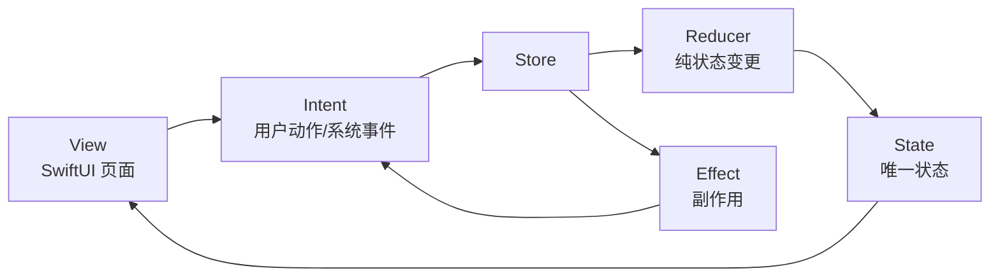
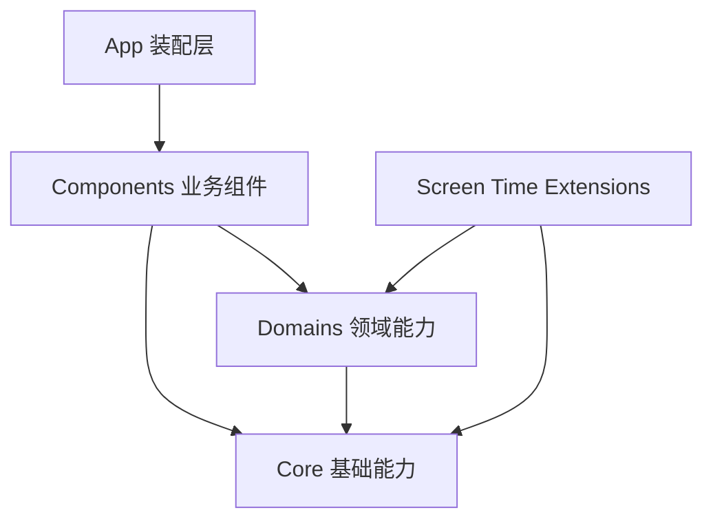
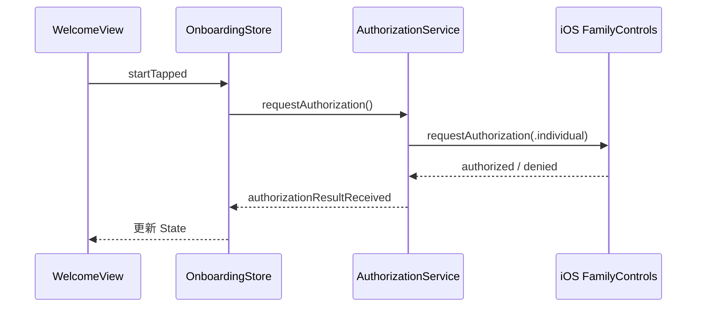
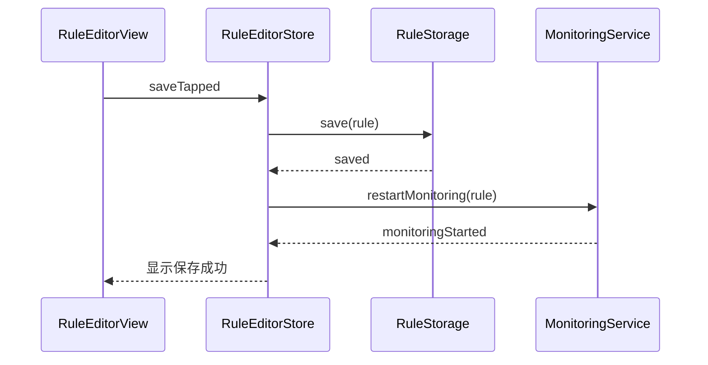
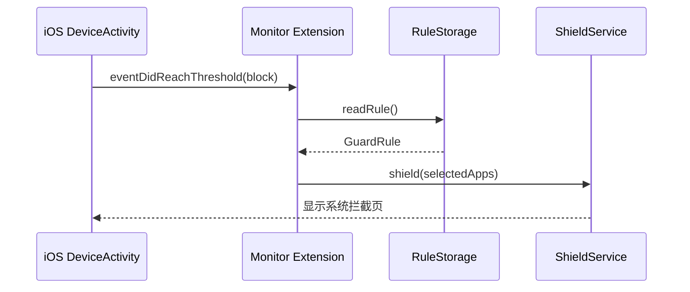

# 技术架构文档：App 使用守卫

## 1. 技术栈

### 1.1 开发语言与 UI

- Swift
- SwiftUI
- Combine
- Swift Concurrency：`async/await`

说明：

- SwiftUI 负责主 App 页面。
- Combine 用于 `Store` 状态发布和简单事件流。
- `async/await` 用于授权、通知权限、规则保存等异步流程。

### 1.2 iOS 官方能力

- FamilyControls
- DeviceActivity
- ManagedSettings
- ManagedSettingsUI
- UserNotifications
- App Groups

用途：

- `FamilyControls`：请求屏幕使用时间权限，选择要限制的 App。
- `DeviceActivity`：监听选中 App 的使用时间，并在阈值到达时回调。
- `ManagedSettings`：对选中的 App 应用系统遮罩。
- `ManagedSettingsUI`：自定义系统拦截页。
- `UserNotifications`：到提醒阈值时发送本地通知。
- `App Groups`：主 App 和扩展共享规则配置。

### 1.3 数据存储

第一版使用：

- App Group `UserDefaults`
- `Codable`

后续可选：

- SwiftData
- SQLite

第一版不建议直接上数据库。规则数据很少，`UserDefaults + Codable` 足够，也更容易学习和调试。

### 1.4 测试

- XCTest
- ViewModel / Store 单元测试
- 规则计算测试
- 配置编解码测试

真机验证：

- Screen Time 授权
- App 选择
- 使用时长阈值触发
- 系统拦截页展示
- 微信读书跳转实验

## 2. 架构范式：MVI

本项目使用“组件化架构 + 组件内部 MVI”。

组件化负责长期扩展，MVI 负责单个组件内部的状态可预测。

第一版组件边界先按 Tab 切：

- 今日组件
- 规则组件
- 设置组件

后续扩展时，可以继续新增：

- 习惯组件
- 统计组件
- Mac 联动组件
- 复盘组件
- 目标管理组件

每个业务组件内部使用 MVI：Model - View - Intent。

核心思想：

- View 只负责展示状态和发送用户意图。
- Intent 表示用户行为或系统事件。
- Reducer 根据 Intent 生成新的 State。
- Effect 处理副作用，比如授权、保存、启动监控、发送通知。
- State 是页面的唯一事实来源。



## 3. 组件化分层结构

```text
AppUsageGuard/
├── App/
│   ├── AppUsageGuardApp.swift
│   └── RootView.swift
├── Core/
│   ├── MVI/
│   │   ├── Store.swift
│   │   ├── Reducer.swift
│   │   └── Effect.swift
│   ├── DesignSystem/
│   │   ├── Components/
│   │   ├── Theme/
│   │   └── Icons/
│   ├── Navigation/
│   │   ├── AppRoute.swift
│   │   └── TabRoute.swift
│   ├── Storage/
│   │   ├── KeyValueStorage.swift
│   │   └── AppGroupStorage.swift
│   └── Shared/
│       ├── AppGroup.swift
│       ├── Constants.swift
│       └── Logger.swift
├── Domains/
│   ├── ScreenTime/
│   │   ├── Models/
│   │   │   ├── GuardRule.swift
│   │   │   ├── RuleRuntimeState.swift
│   │   │   └── RuleState.swift
│   │   ├── Services/
│   │   │   ├── AuthorizationService.swift
│   │   │   ├── ActivitySelectionService.swift
│   │   │   ├── MonitoringService.swift
│   │   │   └── ShieldService.swift
│   │   └── Repositories/
│   │       └── RuleRepository.swift
│   ├── Habit/
│   │   ├── Models/
│   │   └── Services/
│   ├── Analytics/
│   │   ├── Models/
│   │   └── Services/
│   └── ReplacementAction/
│       ├── Models/
│       └── Services/
├── Components/
│   ├── OnboardingComponent/
│   ├── TodayComponent/
│   ├── RulesComponent/
│   ├── SettingsComponent/
│   └── SharedComponents/
├── Extensions/
│   ├── DeviceActivityMonitorExtension/
│   ├── ShieldConfigurationExtension/
│   └── ShieldActionExtension/
└── Tests/
```

## 4. 架构层职责

### 4.1 App 层

职责：

- App 入口。
- 注入依赖。
- 装配组件。
- 管理全局导航。
- 决定展示 Onboarding 还是主 Tab。

不做：

- 不直接写业务规则。
- 不直接操作 `ManagedSettingsStore`。
- 不直接读写规则数据。

### 4.2 Core 层

职责：

- 提供和业务无关的基础能力。
- 提供 MVI 基础类型。
- 提供设计系统。
- 提供导航抽象。
- 提供通用存储接口。
- 提供日志能力。

Core 层不应该依赖任何具体业务组件。

### 4.3 Domains 层

职责：

- 承载可复用的业务领域能力。
- 包装系统 API。
- 为组件提供稳定接口。
- 让未来的习惯管理、统计、Mac 联动可以复用同一套领域模型。

第一版领域：

- `ScreenTime`：App 使用限制、授权、监控、遮罩。
- `ReplacementAction`：微信读书等替代动作。

未来领域：

- `Habit`：个人习惯、目标、打卡、复盘。
- `Analytics`：手机和电脑使用时间统计。
- `MacSync`：Mac 端数据同步和合并。

### 4.4 Components 层

职责：

- 每个业务组件独立拥有自己的 MVI。
- 每个 Tab 是一个组件。
- 组件只通过 Domain Service / Repository 获取能力。
- 组件之间不直接互相调用。

第一版组件：

- `OnboardingComponent`
- `TodayComponent`
- `RulesComponent`
- `SettingsComponent`

后续组件：

- `HabitsComponent`
- `AnalyticsComponent`
- `MacSyncComponent`
- `ReviewComponent`

### 4.5 Extensions 层

职责：

- 接收 iOS Screen Time 系统回调。
- 读取 App Group 中的共享规则。
- 应用遮罩。
- 提供系统拦截页配置。
- 处理拦截页按钮动作。

扩展不承载复杂业务逻辑。复杂判断应尽量下沉到 `Domains/ScreenTime` 中的纯 Swift 类型，方便主 App 和扩展复用。

## 5. 组件边界设计

### 5.1 组件原则

- 一个组件对应一个明确业务区域。
- 一个 Tab 默认就是一个组件。
- 组件内部可以有多个页面。
- 组件内部使用 MVI。
- 组件之间通过导航或共享 Domain 状态协作，不直接互调 Store。
- 组件对外暴露 `ComponentEntryView` 或 `ComponentBuilder`。

### 5.2 TodayComponent

职责：

- 展示当前保护状态。
- 展示今天是否已提醒、已拦截、冷却中。
- 提供进入规则编辑的入口。
- 硬核模式下不提供即时暂停。

依赖：

- `RuleRepository`
- `MonitoringService`
- `RuleRuntimeState`

### 5.3 RulesComponent

职责：

- 编辑限制 App、时间阈值、冷却时间。
- 编辑硬核模式。
- 编辑提醒文案和拦截文案。
- 编辑微信读书替代动作。
- 判断修改是立即生效还是待生效。

依赖：

- `RuleRepository`
- `ActivitySelectionService`
- `MonitoringService`
- `ReplacementActionService`

### 5.4 SettingsComponent

职责：

- 展示授权状态。
- 重新授权。
- 通知设置。
- 数据重置。
- 关于页面。

依赖：

- `AuthorizationService`
- `NotificationService`
- `RuleRepository`

### 5.5 未来组件示例

`AnalyticsComponent`：

- 展示手机 App 使用统计。
- 展示电脑使用统计。
- 展示拖延高峰时段。
- 展示趋势。

`HabitsComponent`：

- 管理阅读、运动、睡眠、学习等习惯。
- 支持习惯目标。
- 支持和 App 限制联动。

`MacSyncComponent`：

- 连接 Mac 端 companion app。
- 接收电脑使用数据。
- 合并手机和电脑时间线。

## 6. 组件内部 MVI 结构

每个页面一个 MVI 模块：

- `State`
- `Intent`
- `Reducer`
- `Store`
- `View`

例如：

```text
Features/RuleEditor/
├── RuleEditorState.swift
├── RuleEditorIntent.swift
├── RuleEditorReducer.swift
├── RuleEditorStore.swift
└── RuleEditorView.swift
```

在组件化目录中实际会这样放：

```text
Components/RulesComponent/
├── RulesComponent.swift
├── RuleEditor/
│   ├── RuleEditorState.swift
│   ├── RuleEditorIntent.swift
│   ├── RuleEditorReducer.swift
│   ├── RuleEditorStore.swift
│   └── RuleEditorView.swift
├── AppSelection/
│   ├── AppSelectionState.swift
│   ├── AppSelectionIntent.swift
│   ├── AppSelectionReducer.swift
│   ├── AppSelectionStore.swift
│   └── AppSelectionView.swift
└── RulePreview/
```

## 7. MVI 设计细节

### 7.1 State

State 是页面渲染的唯一来源。

示例：

```swift
struct RuleEditorState: Equatable {
    var draftRule: GuardRule
    var authorizationStatus: AuthorizationStatusViewState
    var isSaving: Bool
    var validationMessage: String?
    var pendingChangeMessage: String?
}
```

注释要求：

- 每个 `State` 文件顶部说明这个状态服务哪个页面。
- 对容易误解的字段写注释，比如 `draftRule` 和 `pendingRule` 的区别。

### 7.2 Intent

Intent 表示“发生了什么”，不写“怎么做”。

示例：

```swift
enum RuleEditorIntent {
    case appeared
    case ruleNameChanged(String)
    case appSelectionChanged(FamilyActivitySelection)
    case reminderThresholdChanged(Int)
    case blockThresholdChanged(Int)
    case hardModeToggled(Bool)
    case saveTapped
    case testReminderTapped
    case testReplacementActionTapped
}
```

命名规则：

- 用户动作使用过去式或动作描述：`saveTapped`、`appeared`。
- 输入变化使用 `xxxChanged`。
- 系统回调使用 `xxxReceived`。

### 7.3 Reducer

Reducer 只处理同步状态变更。

原则：

- 不请求授权。
- 不读写磁盘。
- 不启动监控。
- 不发送通知。
- 不打开微信读书。

示例：

```swift
struct RuleEditorReducer {
    func reduce(state: inout RuleEditorState, intent: RuleEditorIntent) -> RuleEditorEffect? {
        switch intent {
        case .ruleNameChanged(let name):
            state.draftRule.name = name
            state.validationMessage = validate(rule: state.draftRule)
            return nil

        case .saveTapped:
            state.isSaving = true
            return .saveRule(state.draftRule)

        default:
            return nil
        }
    }
}
```

注释要求：

- Reducer 中只对复杂分支加注释。
- 注释解释“为什么这样转移状态”，不要解释 Swift 语法。

### 7.4 Effect

Effect 表示副作用。

示例：

```swift
enum RuleEditorEffect {
    case saveRule(GuardRule)
    case requestAuthorization
    case startMonitoring(GuardRule)
    case sendTestNotification
    case testReplacementAction(ReplacementActionConfig)
}
```

Effect Handler 负责真正调用服务。

## 8. 依赖规则

组件化架构最怕后期互相乱依赖，所以第一版就定义依赖方向。

允许的依赖方向：



禁止：

- `Core` 依赖 `Domains`。
- `Core` 依赖 `Components`。
- `Domains` 依赖 `Components`。
- 一个业务组件直接调用另一个业务组件的 Store。
- View 直接调用系统 API。
- Reducer 直接执行副作用。

组件之间协作方式：

- 通过 App 层导航。
- 通过 Domain Repository 共享领域数据。
- 通过轻量事件或路由传递一次性意图。

## 9. 未来扩展架构

这个 App 未来会从“限制刷 App”扩展成“个人生活、学习、习惯管理工具”。因此第一版的数据和能力要避免写死成只服务微信。

### 9.1 未来功能方向

App 使用统计：

- 手机 App 使用时长。
- 高频打开次数。
- 晚间高风险时段。
- 被拦截次数。
- 放下手机后的替代行为。

习惯管理：

- 阅读习惯。
- 学习习惯。
- 运动习惯。
- 睡眠准备。
- 每日复盘。

Mac 联动：

- Mac 端 companion app 统计应用和网站使用。
- iPhone 与 Mac 数据合并。
- 识别跨设备拖延模式。
- 手机端展示个人时间账本。

### 9.2 未来组件形态

```text
Components/
├── TodayComponent/
├── RulesComponent/
├── SettingsComponent/
├── AnalyticsComponent/
├── HabitsComponent/
├── ReviewComponent/
└── MacSyncComponent/

Domains/
├── ScreenTime/
├── Habit/
├── Analytics/
├── MacSync/
└── Identity/
```

### 9.3 为什么现在不直接做复杂架构

第一版仍然保持轻量：

- 不做多模块 Swift Package 拆分。
- 不引入复杂依赖注入框架。
- 不引入数据库。
- 不引入云同步。

但目录、依赖方向、领域边界先按可扩展方式设计。等功能超过 4-5 个组件后，再把 `Core`、`Domains`、`Components` 拆成 Swift Package。

## 10. 全局数据流

### 10.1 首次授权



### 10.2 保存规则



### 10.3 到达拦截阈值



## 11. 硬核模式设计

硬核模式是第一版核心能力。

### 11.1 规则

硬核模式开启后：

- 禁止延迟。
- 禁止临时暂停。
- 当前生效时段内不能立即关闭规则。
- 当前生效时段内不能立即降低限制。
- 降低限制的修改进入待生效状态。

### 11.2 什么是“降低限制”

以下修改都算降低限制：

- 关闭规则。
- 关闭硬核模式。
- 开启延迟。
- 开启临时暂停。
- 延长提醒时间。
- 延长拦截时间。
- 缩短冷却时间。
- 缩短生效时段。
- 移除被限制的 App。

以下修改可以立即生效：

- 添加被限制的 App。
- 缩短提醒时间。
- 缩短拦截时间。
- 延长冷却时间。
- 延长生效时段。
- 修改提醒文案。
- 修改拦截文案。

### 11.3 待生效规则

当用户在硬核模式下降低限制：

- 当前规则保持不变。
- 新规则保存为 `pendingRule`。
- `pendingRuleActivationDate` 默认为第二天 00:00。
- 到时间后自动替换当前规则。

## 12. 微信读书替代动作

### 12.1 稳定方案

拦截页展示：

- 标题：先停一下
- 说明：现在离开微信，去微信读书读 10 分钟。
- 主按钮：好的
- 次按钮：去微信读书

点击“去微信读书”：

- `ShieldActionExtension` 返回 `.close`。
- 系统关闭当前被拦截 App。
- 用户按提示打开微信读书。

### 12.2 实验方案

App 内提供“测试打开微信读书”。

支持方式：

- 自定义 URL Scheme。
- 快捷指令 URL Scheme。

如果真机测试成功：

- 开启自动跳转。

如果失败：

- 退回稳定方案。

## 13. 扩展通信

主 App 和扩展不能直接共享内存，需要通过 App Group 共享配置。

共享内容：

- 当前规则 `GuardRule`
- 待生效规则 `pendingRule`
- 运行状态 `RuleRuntimeState`
- 拦截页文案
- 微信读书替代动作配置

共享方式：

- `UserDefaults(suiteName: appGroupIdentifier)`
- JSON 编码的 `Codable` 数据

## 14. 注释规范

这个项目同时用于学习 iOS 开发，所以注释要比生产项目略多，但仍然保持克制。

项目内注释统一使用中文。只有以下情况保留英文：

- Apple 官方类型名、方法名、协议名。
- 第三方库或系统 API 的固定名称。
- Xcode 自动生成且不建议修改的模板注释。

应该写注释的地方：

- 每个文件顶部说明职责。
- 每个 Service 说明它封装的系统 API。
- Reducer 中复杂状态转移。
- 硬核模式判断。
- App Group 共享数据。
- Screen Time 扩展生命周期。
- 微信读书跳转的系统限制。

不写注释的地方：

- 不解释简单 Swift 语法。
- 不写“设置变量值”这类无信息注释。
- 不重复函数名已经表达清楚的内容。

示例：

```swift
/// RuleEditorStore 持有规则编辑页的可编辑状态。
/// 副作用统一交给 Effect Handler，方便单独测试规则校验逻辑。
@MainActor
final class RuleEditorStore: ObservableObject {
    @Published private(set) var state: RuleEditorState
}
```

```swift
/// 判断一次规则修改是否会降低限制强度。
/// 硬核模式下，降低限制的修改不能立即生效，需要保存为待生效规则。
func isWeakerChange(from oldRule: GuardRule, to newRule: GuardRule) -> Bool {
    // ...
}
```

## 15. 新建项目与真机安装策略

### 15.1 新建项目方式

推荐使用 Xcode 手动新建项目，而不是先用脚本生成。

原因：

- iOS App + Screen Time 扩展涉及多个 Target。
- Family Controls、App Groups、Signing & Capabilities 最好直接在 Xcode 中配置。
- 你也希望学习 iOS 开发，Xcode 的项目结构和签名配置值得亲手过一遍。

建议项目信息：

- Product Name：`TingYiXia`
- Display Name：`停一下`
- Bundle Identifier：`com.yanyu.tingyixia`
- Interface：SwiftUI
- Language：Swift
- Minimum iOS：建议 iOS 17 或 iOS 18，第一版按你的真机系统版本决定
- Storage：第一版不勾选 SwiftData
- Tests：勾选 Unit Tests

第一版 Targets：

- 主 App：`TingYiXia`
- Device Activity Monitor Extension
- Shield Configuration Extension
- Shield Action Extension

后续可选 Target：

- Device Activity Report Extension，用于做统计报表时再加。

### 15.2 Signing & Capabilities

每个相关 Target 都需要配置签名和能力。

主 App：

- Automatically manage signing
- Team：你的 Apple ID 对应的 Team
- App Groups
- Family Controls

Device Activity Monitor Extension：

- Automatically manage signing
- App Groups
- Family Controls

Shield Configuration Extension：

- Automatically manage signing
- App Groups
- Family Controls

Shield Action Extension：

- Automatically manage signing
- App Groups
- Family Controls

App Group 命名建议：

- `group.com.yanyu.tingyixia`

### 15.3 没有付费开发者账号能不能装到自己手机

可以先试。

Apple 官方文档说明，Xcode 可以把 App 运行到真机上；运行前需要把 Apple Account 添加到 Xcode，选择有效 Team，开启自动签名，并在 iPhone 上启用 Developer Mode。Xcode 文档也说明：如果你不是 Apple Developer Program 成员，Xcode 会为你创建 Personal Team。

但要注意两点：

1. 普通个人 Apple ID 通常适合做基础真机调试。
2. 本项目依赖 `FamilyControls` 等特殊 entitlement，Apple 文档明确要求添加 Family Controls capability，并在开发时通过 Apple Developer Program 配置能力。实际是否能用 Personal Team 跑通，需要在真机上尽早验证。

因此推荐路径：

- 第一步：用普通 Apple ID + Personal Team 创建项目，先跑通普通 SwiftUI 页面。
- 第二步：添加 Family Controls 和扩展，尝试真机授权。
- 第三步：如果 Xcode 报 provisioning profile 缺少 `com.apple.developer.family-controls`，就需要注册 Apple Developer Program。

### 15.4 真机安装步骤

1. 在 Mac 安装最新版 Xcode。
2. Xcode Settings > Accounts 添加你的 Apple ID。
3. iPhone 用数据线连接 Mac，并在手机上选择信任这台电脑。
4. iPhone 打开 Developer Mode。
5. Xcode 里选择你的 iPhone 作为运行设备。
6. Project > Signing & Capabilities 中打开 Automatically manage signing。
7. Team 选择你的 Personal Team 或付费开发者 Team。
8. 先运行空壳 App。
9. 再逐步添加 App Groups、Family Controls 和扩展。
10. 每加一个能力就真机跑一次，尽早发现签名或 entitlement 问题。

### 15.5 为什么不要一上来就把所有能力加满

Screen Time 相关能力对签名、entitlement、扩展配置都比较敏感。

推荐增量验证：

1. 空 SwiftUI App 可以安装。
2. 组件化目录可以编译。
3. MVI Store 可以跑。
4. App Group 可以读写。
5. Family Controls 可以授权。
6. FamilyActivityPicker 可以选择 App。
7. DeviceActivity 扩展可以收到回调。
8. ManagedSettings 可以遮罩 App。

这样每一步出了问题，都知道问题在哪一层。

## 16. 推荐实现顺序

1. 搭建 SwiftUI 项目和组件化目录结构。
2. 建立 MVI 基础类型：`Store`、`Reducer`、`Effect`。
3. 实现 `Core` 基础能力：设计系统、导航、App Group 存储。
4. 实现 `Domains/ScreenTime` 的 `GuardRule`、`RuleRepository` 和本地存储。
5. 实现 `OnboardingComponent`：授权流程。
6. 实现 `RulesComponent`：App 选择和规则编辑。
7. 实现硬核模式和待生效规则。
8. 实现 `TodayComponent`：当前保护状态。
9. 实现 DeviceActivity 监控。
10. 实现提醒通知。
11. 实现系统拦截页。
12. 实现 `ReplacementAction`：微信读书替代动作。
13. 实现 `SettingsComponent`。
14. 真机测试和修正。
